#

# 注解概述

> 注解（Annotation）: 放在Java源码的类、方法、字段、参数前的一种特殊“注释”

### 一、注解简介（Java.Annotation）

- Annotation 是从JDK5.0以后引入的新技术

  

- Annotation 的作用
  
  
  
  - 不是程序本身，可以对程序作出解释（这一点和注解（comment）没什么区别）
  
    
  
  - <span style="color:red;">可以被其他程序（比如：编译器）读取</span>
  
    
  
- Annotation 的格式：
  
  
  
  - 注解是以“@注释名”在代码中存在的，还可以添加一些参数值，例如：@SuppressWarnings(value="unchecked")
  
    
  
- Annotation 在哪里使用？
  
  
  
  - 可以附加在 package、class、method、field 等上面，相当于给他们添加了额外的辅助信息，我们可以通过反射机制编程实现对这些元数据的访问 
  
    

### 二、注解分类

**1.按来源分**

- 内置注解（JDK自带）

  

- 元注解

  

- 自定义注解

  

**2.按生命周期分**

- SOURCE：只存在于源代码中，编译成 class 文件不复存在

  

- Class：存在于源代码中和 class 文件中

  

- RUNTIME：注解保留到运行时

  

------


# 内置注解

JavaSE中内置三个标准注解，定义在 java.lang 中，它们分别是：

- **@Override**：定义在 java.lang.Override 中，此注释只适用于修辞方法，表示一个方法声明打算重写超类中的另一个方法声明

  

- **@Deprecated**：定义在 java.lang.Deprecated 中，此注释可以用于修饰方法、属性、类，表示不鼓励程序员使用这样的元素，通常是因为它很危险或者存在更好的选择

  

- **@SuppressWarnings**：定义在 java.lang.SuppressWarnings 中，用来抑制编译时的警告信息
  
  
  
  - 与前两个注释有所不同，你需要添加一个参数才嗯那个正确使用，这些参数都是已经定义好了的，我们选择性的使用就好了。
    
    
    
    1. @SuppressWarnings("all")
    
       
    
    2. @SuppressWarnings("unchecked")
    
       
    
    3. @SuppressWarnings(value = {"unchecked","deprecation"})
    
       
    
    4. ......

参考代码：

```java
public class BuiltInAnnotation {

    /**
     * Override：此注解只适用于修辞方法，重写超类中某方法
     * @return
     */
    @Override
    public String toString() {
        return super.toString();
    }

    /**
     * Deprecated：过时的、危险的、不推荐使用的，但仍可使用
     */
    @Deprecated
    public static void testDeprecated(){
        System.out.println("Hello Deprecated!");
    }

    /**
     * SuppressWarnings：抑制程序编译时的警告信息
     */
    @SuppressWarnings("all")
    public static void testSuppressWarnings(){
        int flag = 0;
    }

    public static void main(String[] args) {
        testDeprecated();
    }

}
```

------


# 元注解

- 元注解的作用就是负责注解其它注解，Java 定义了 4 个标准的 meta-annotation 类型，它们被用来提供对其它注解类型做说明

  

- 这些类型和它们所支持的类在 java.lang.annotation 包中可以找到（@Target，@Retention，@Documented，@Inherited）
  
  
  
  - **@Target**：用于描述注解的使用范围（即：被描述的注解可以用在什么地方）
  
    
  
  - **@Retention**：表示需要在什么级别保存该注释信息，用于描述注解的生命周期（SOURCE < CLASS < RUNTIME）
  
    
  
  - **@Document**：说明该注解将被包含在 JavaDoc 中
  
    
  
  - **@Inherited**：说明子类可以继承父类中的该注解
  
    

参考代码：

```java
@MyAnnotation
public class MetaAnnotation {

    /**
     * Java中定义了四个标注的元注解类型来对其他注解类型进行修饰
     * 1.@Target : 用于描述注解的使用范围,即被描述的注解可以用在什么地方
     * 2.@Retention : 用于描述注解的生命周期，即用在什么级别保存该注释信息（SOURCE < CLASS < RUNTIME）
     * 3.@Documented ：用于描述该注解将生成于 javadoc 中
     * 4.@Inherited ：用于描述子类可以继承父类中的注解
     */

    @MyAnnotation
    public void test(){

    }

}


@Target(value = {ElementType.TYPE, ElementType.FIELD,ElementType.METHOD})
@Retention(value = RetentionPolicy.RUNTIME)
@Documented
@Inherited
@interface MyAnnotation{

}
```

------


# 自定义注解

- 使用 @interface 自定义注解时，自动继承了 java.lang.annotation.Annotation 接口

  

- 分析：
  
  
  
  - @interface 用来声明一个注解，格式：public @interface 注解名 {定义内容}
  
    
  
  - 其中的每一个方法实际上是声明了一个配置参数
  
    
  
  - 方法的名称就是参数的名称
  
    
  
  - 返回值类型就是参数的类型（返回值只能是基本类型，Class，String，enum）
  
    
  
  - 可以通过 default 来声明参数的默认值
  
    
  
  - 如果只有一个参数成员，一般参数名为 value
  
    
  
  - 注解元素必须要有值，我们定义注解元素时，经常使用空字符串，0 作为默认值
  
    

参考代码：

```java
@MyCustomAnnotation(age = 0)
public class CustomAnnotation {

    /**
     * 1.使用@interface声明一个注解（ Public @interface xx{} ）
     * 2.其中每一个方法即为该注解的配置参数，方法名称就是参数名称，
     * 3.返回值类型可选：基本类型、Class、String、enum
     * 4.通过default声明参数的默认值，如果没有定义默认值，使用时必须对其参数进行赋值，如果只存在一个参数，一般命名为value
     * 5.注解元素必须要有值
     */

    @MyCustomAnnotation(age = 1, welcome = "Hello World!", personalAdvantages = {"玉树临风", "风流潇洒"})
    public void test() {

    }

}

/**
 * @author Tao
 */
@Target({ElementType.TYPE, ElementType.METHOD})
@interface MyCustomAnnotation {

    String welcome() default "Hello MyCustomAnnotation!";

    int age();

    String[] personalAdvantages() default {"阳光", "帅气"};

}
```

------


# 反射概述

> 反射是Java的高级特性，在框架中大量被使用！

### 一、静态语言和动态语言

- **静态语言**：与动态语言相对应，运行时结构不可变的语言就是静态语言，如 Java、C、C++

  

- **动态语言**：是一类在运行时可以改变其结构的语言：例如新的函数、对象、甚至代码可以被引进，已有的函数可以被删除或是其它结构上的变化（在运行时代码可以根据某些条件改变自身结构），如Object-C、C#、JavaScrip、PHP、Python

  

  以 JavaScript 为例：
  
  ```javascript
  var i = 100;
  function test() {
      var i = 'test';
      eval('i = "Hello World!"');
  }
  test();
  alert(i); 
  ```

<span style="color:red;">Java 不是静态语言，但是 Java 可以称之为 “准动态语言”。即 Java 有一定的动态性，我们可以利用反射机制获得类似动态语言的特性，让编程的时候更加灵活。</span>

### 二、反射机制

**反射（Reflection）**：是 Java 被视为动态语言的关键，反射机制允许程序在执行期借助于 Reflection API 取得任何类的内部信息，并能直接操作任意对象的内部属性以及方法。

```java
Class class = Class.forName("java.lang.String");
```

加载完类之后，在堆内存的方法区中就产生了一个 Class 类型的对象（一个类只有一个 Class 对象），这个对象就包含了完整类的类的结构信息。我们可以通过这个对象看到的类的结构。这个对象就像一面镜子，通过这个镜子看到类的结构，所以，我们形象地称之为：反射。

- 正常方式：1.引入需要的“包类”名称   ——>   2.通过 new 实例化   ——>   3.取得实例化对象

  

- 反射方式：1.实例化对象   ——>   2.getClass( ) 方法   ——>   3.得到完整的“包类”名称

### 三、反射机制提供的功能

- 在运行时判断任意一个对象所属的类

  

- 在运行时构造任意一个类的对象

  

- 在运行时判断任意一个类所具有的成员变量和方法

  

- 在运行时获取泛型信息

  

- 在运行时调用任意一个对象的成员变量和方法

  

- 在运行时处理注解

  

- 生成动态代理

### 四、反射的优缺点

- **优点：** 可以实现动态创建对象和编译，体现出很大的灵活性

  

- **缺点：** 对性能有影响。使用反射基本上是一种解释操作，我们可以告诉 JVM，我们希望做什么并且它满足我们什么要求，这类操作总是慢于直接执行相同的操作

### 五、反射相关的主要API

- java.lang.Class 代表一个类

  

- java.lang.reflect.Method 代表类的方法

  

- java.lang.reflect.Field 代表类的成员变量

  

- java.lang.reflect.Constructor 代表类的构造器

------


# 获得反射对象

定义一个实体类 Person

```java
public class Person {

    public String id;

    public String name;

    public int age;

    public Person() {

    }

    public Person(String id, String name, int age) {
        this.id = id;
        this.name = name;
        this.age = age;
    }

    public String getId() {
        return id;
    }

    public void setId(String id) {
        this.id = id;
    }

    public String getName() {
        return name;
    }

    public void setName(String name) {
        this.name = name;
    }

    public int getAge() {
        return age;
    }

    public void setAge(int age) {
        this.age = age;
    }

    @Override
    public String toString() {
        return "Person{" +
                "id='" + id + '\'' +
                ", name='" + name + '\'' +
                ", age=" + age +
                '}';
    }

}
```

获得其反射对象

```java
public static void testHashCode() throws ClassNotFoundException {
    Class c1 = Class.forName("com.tao.annotationandreflection.reflection.entity.Person");
    Class c2 = Class.forName("com.tao.annotationandreflection.reflection.entity.Person");
    Class c3 = Class.forName("com.tao.annotationandreflection.reflection.entity.Person");
    System.out.println(c1.hashCode());
    System.out.println(c2.hashCode());
    System.out.println(c3.hashCode());
}
```

输出


<span style="color:red;">哈希值一致说明一个类在JVM中只存在一个Class对象</span>

------


# Class类

### 一、认识 Class 类

在 Java 中 Object 类是所有类的父类。 该类中定义了以下方法，此方法将被所有子类继承。


即：

```java
public final native Class<?> getClass();
```

上面的方法返回值的类型是一个 Class 类，此类是 Java 反射的源头，实际上所谓反射从程序的运行结果来看也很好理解，即：可以通过对象反射求出类的名称。


对于每个类而言，JRE 都为其保留了一个不变的 Class 类型的对象。一个 Class 对象包含了特定某个结构（class、interface、enum、annotation、primitive type、void、[]）

- Class 本身也是一个类

  

- Class 对象只能由系统建立对象

  

- <span style="color:red;">一个加载的类在 JVM 中只会有一个 Class 实例</span>

  

- 一个 Class 对象对应的是一个加载到 JVM 中的一个 .class 文件

  

- 每个类的实例都会记得自己是由哪个 Class 实例所生成

  

- 通过 Class 可以完整地得到一个类中的所有被加载的结构

  

- Class 类是 Reflection 的根源，针对任何你想动态加载、运行的类、唯有先获得响应的 Class 对象

  

### 二、Class 类的常用方法

| 方法名                                  | 功能说明                                                     |
| :-------------------------------------- | :----------------------------------------------------------- |
| static Class forName(String name)       | 返回指定类名 name 的 Class 对象                              |
| Object newInstance()                    | 调用缺省构造函数，返回 Class 对象的一个实例                  |
| getName()                               | 返回此 Class 对象所表示的实体（类、接口、数组类、或 void）的名称 |
| Class getSuperClass()                   | 返回当前 Class 对象的父类的 Class 对象                       |
| Class[] getInterfaces()                 | 获取当前 Class 对象的接口                                    |
| ClassLoader getClassLoader()            | 返回该类的类加载器                                           |
| Constructor[] getConstructors()         | 返回一个包含某些 Constructor 对象的数组                      |
| Method getMethod(String name, Class… T) | 返回一个 Method 对象，此对象的形参类型为 paramType           |
| Field[] getDeclaredFields()             | 返回 Field 对象的一个数组                                    |

------


# 所有类型的Class对象

拥有Class对象的类型有：

- class：外部类、成员（成员内部类、静态内部类）、局部内部类、匿名内部类

  

- interface：接口

  

- []：数组

  

- enum：枚举

  

- annotation：注解 @interface

  

- primitive type：基本数据类型

  

- void

  

测试代码：

```java
public static void testClass() {
    Class c1 = Object.class;
    Class c2 = Comparable.class;
    Class c3 = int[].class;
    Class c4 = String[][].class;
    Class c5 = ElementType.class;
    Class c6 = Override.class;
    Class c7 = Integer.class;
    Class c8 = void.class;
    Class c9 = Class.class;

    System.out.println(c1);
    System.out.println(c2);
    System.out.println(c3);
    System.out.println(c4);
    System.out.println(c5);
    System.out.println(c6);
    System.out.println(c7);
    System.out.println(c8);
    System.out.println(c9);
}
```

运行结果：


------

# 获取Class类的几种方式

- 已知具体的类，可通过其类的class属性获取（最为安全可靠，性能最好）

  ```java
  Class class = Person.class;
  ```

- 已知某个类的实例，调用其getClass()方法获取Class对象

  ```java
  Class class = person.getClass();
  ```

- 已知一个类的全类名，且该类处于该路径下，可通过Class类的静态方法forName()获取（抛出异常ClassNotFoundException）

  ```java
  Class class = Class.forName("com.tao.annotationandreflection.reflection.entity.Person");
  ```

- 内置基本数据类型可通过.TYPE获取

  ```java
  Class c4 = 类名.TYPE;  
  ```

- 利用类加载器获取

  ```java
  ClassLoader classLoader = this.getClass().getClassLoader();
  Class class = classLoader.loadClass("com.tao.annotationandreflection.reflection.entity.Person");
  ```

参考代码：

```java
public void testWays() throws ClassNotFoundException {
    //  已知具体的类，可通过其类的class属性获取（最为安全可靠，性能最好）
    Class c1 = Person.class;

    //  已知某个类的实例，调用其getClass()方法获取Class对象
    Person person = new Person();
    Class c2 = person.getClass();

    //  已知一个类的全类名，且该类处于该路径下，可通过Class类的静态方法forName()获取（抛出异常ClassNotFoundException）
    Class c3 = Class.forName("com.tao.annotationandreflection.reflection.entity.Person");

    //  内置基本数据类型可通过.TYPE获取
    Class c4 = Integer.TYPE;    //  这里：(Class<Integer>) Class.getPrimitiveClass("int");

    //  利用类加载器获取
  	ClassLoader classLoader = this.getClass().getClassLoader();
    Class c5 = classLoader.loadClass("com.tao.annotationandreflection.reflection.entity.Person");
}
```

------


# 类加载内存分析

### 一、Java 内存分析

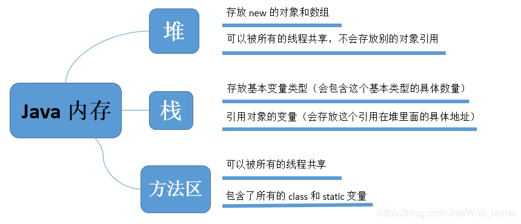


### 二、类的加载过程

当程序主动使用某个类时，如果该类还未被加载到内存中，则系统会通过如下三个步骤来对该类进行初始化。

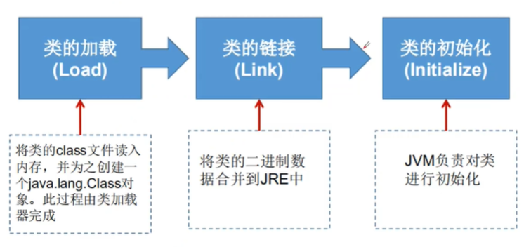

- 加载：将 .class 文件字节码内容加载到内存中，并将这些静态数据转换成方法区的运行时数据结构，然后生成一个代表这个类的 java.lang.Class 对象

  

- 链接：将 Java 类的二进制代码合并到 JVM 的运行状态之中的过程

  

  - 验证：确保加载的类信息符合 JVM 规范，没有安全方面的问题

    

  - 准备：正式为类变量（static）分配内存并设置类变量默认初始值的阶段，这些内存都将在方法区中进行分配

    

  - 解析：虚拟机常量池内的符号引用（常量名）替换为直接引用（地址）的过程

    

- 初始化：

  

  - 执行类构造器< clint>() 方法的过程，类构造器< clint>() 方法是由编译期自动收集类中所有类变量的赋值动作和静态代码块中的语句合并产生的（类构造器是构造类信息的，不是构造该类对象的构造器）

    

  - 当初始化一个类的时候，如果发现其父类还没有进行初始化，则需要先触发其父类的初始化

    

  - 虚拟机会保证一个类的< clint>() 方法在多线程环境中被正确加锁和同步

    

测试代码：

```java
public class TestClassLoaderProcess {

    public static void main(String[] args) {
      	//	该打印可说明Java中的静态变量和静态代码块是在类加载的时候就执行（无需初始化），其结果反映 < clint>() 方法
        System.out.println(A.m);				
        A a = new A();
        System.out.println(A.m);
        System.out.println("-------------------");
        B b = new B();
        System.out.println(B.m);
    }

}

class A {

    static {
        System.out.println("进入A的静态代码块方法...");
        m = 200;
    }

    static int m = 100;

    public A() {
        System.out.println("进入A的无参构造方法...");
    }

}

class B {

    static int m = 100;

    static {
        System.out.println("进入B的静态代码块方法...");
        m = 200;
    }

    public B() {
        System.out.println("进入B的无参构造方法...");
    }

}
```

运行结果：

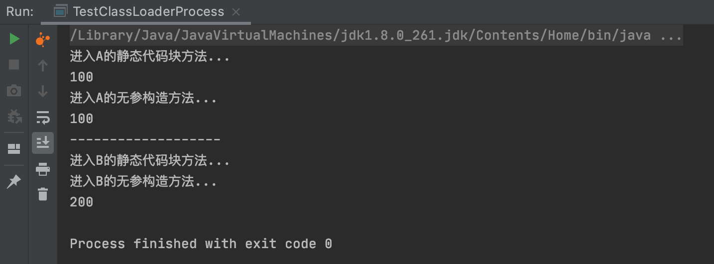

观察程序运行结果可发现：

1. <span style="color:red;">Java 中的静态变量和静态代码块是在类加载的时候就执行的</span> ( 在未初始化A对象之前，即可调用 A.m )

2. <span style="color:red;">执行类构造器 < clint>() 方法过程中，编译器自动收集类中所有类变量的赋值动作和静态代码块中的语句，并将其合并</span> （ 打印第一句A.m ）

3. <span style="color:red;">静态变量和静态代码块也是有执行顺序的，与代码书写的顺序一致</span> （A 类和 B 类中静态变量和静态代码块书写顺序不同导致的打印m结果不同）

   

图解：

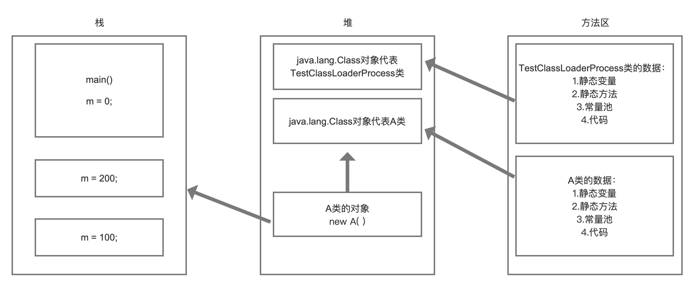


总结（以A类为例）：

1. 将字节码文件加载到内存中，并且生成一个与类对应的Class对象

   

2. 链接，链接结束后 m = 0

   

3. 初始化 < clint>() 合并 {

   ​	System.out.println("进入A的静态代码块方法...")；

   ​	m = 200;

   ​	m = 100;

   }

------


# 分析类初始化

什么时候会发生类的初始化？

- 类的主动引用

  

  - 当虚拟机启动，先初始化 main( ) 方法所在的类
    

  - new 一个类的对象

    

  - 调用类的静态变量（除了 final 常量）和静态方法

    

  - 使用 java.lang.reflect 包的方法对类进行反射调用

  

  - 当初始化一个类，其父类还未被初始化，则会先初始化它的父类

  

- 类的被动引用

  

  - 当访问一个静态域时，只有真正声明这个域的类才会被初始化。如：当通过子类引用父类的静态变量，不会导致子类初始化

    

  - 通过数组定义类引用，不会触发此类的初始化

  

  - 引用常量不会触发此类的初始化（常量在链接阶段就存入调用类的常量池中）

  

  测试代码：

  ```java
  public class TestWhenClassInit {
  
      static {
          System.out.println("main()所在类被加载...");
      }
  
  
      public static void main(String[] args) throws ClassNotFoundException {
          //  主动引用: 1.new一个类的对象
          Son son = new Son();
          //  主动引用: 2.反射
          Class c1 = Class.forName("com.tao.annotationandreflection.reflection.Son");
          //  主动引用: 3.调用类的静态变量（除了 final 常量）和静态方法
          System.out.println(Son.n);
  
          //  被动引用: 1.通过子类引用父类的静态变量，不会导致子类初始化
          System.out.println(Son.m);
          //  被动引用: 2.引用常量不会触发此类的初始化
          System.out.println(Son.N);
          //  被动引用: 3.通过数组定义类引用，不会触发此类的初始化 (这里只是分配了内存)
          Son[] array = new Son[3];
      }
  
  }
  
  class Father {
  
      static {
          System.out.println("父类Father被加载...");
      }
  
      static int m = 0;
  
  }
  
  class Son extends Father {
  
      static {
          System.out.println("子类Son被加载...");
          n = 200;
      }
  
      static int n = 100;
  
      static final int N = 10;
  
  }
  ```

  运行结果：

  

  ```java
   public static void main(String[] args) throws ClassNotFoundException {
   		//  主动引用: 1.new一个类的对象
  		Son son = new Son();
   }
  ```

  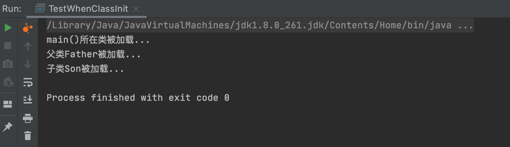

  

  ```java
  public static void main(String[] args) throws ClassNotFoundException {
  		//  主动引用: 2.反射      
  		Class c1 = Class.forName("com.tao.annotationandreflection.reflection.Son");
  }
  ```

  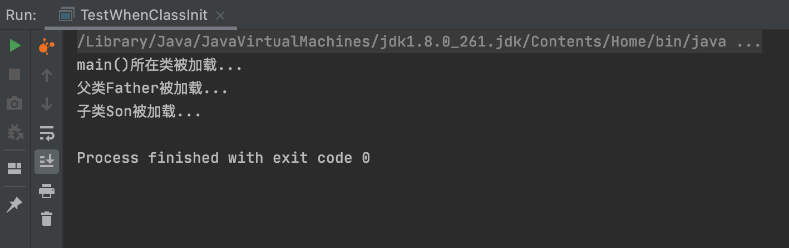

  

  ```java
  public static void main(String[] args) throws ClassNotFoundException {
  		//  主动引用: 3.调用类的静态变量（除了 final 常量）和静态方法 
  		System.out.println(Son.n);
  }
  ```

  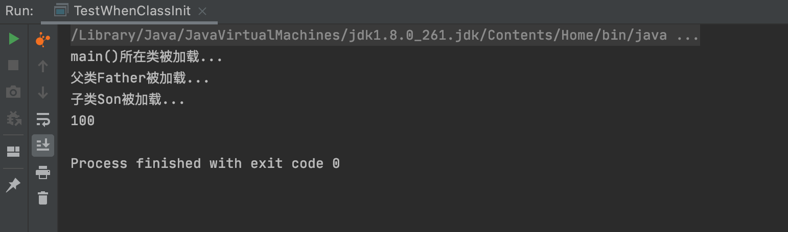

  

  ```java
  public static void main(String[] args) throws ClassNotFoundException {
  		//  被动引用: 1.通过子类引用父类的静态变量，不会导致子类初始化
  		System.out.println(Son.m);
  }
  ```

  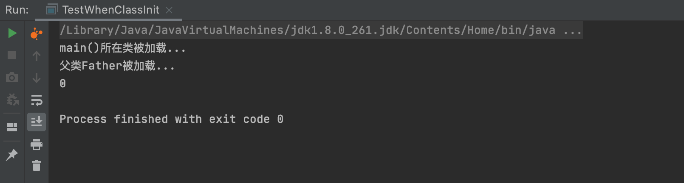

  

  ```java
  public static void main(String[] args) throws ClassNotFoundException {
  		//  被动引用: 2.引用常量不会触发此类的初始化
  		System.out.println(Son.N);
  }
  ```

  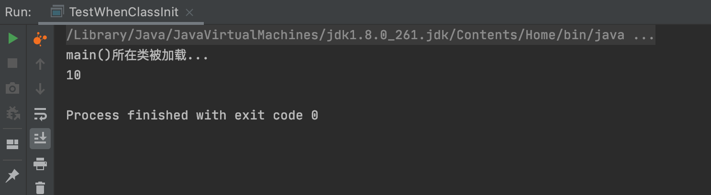

  

  ```java
  public static void main(String[] args) throws ClassNotFoundException {
  		//  被动引用: 3.通过数组定义类引用，不会触发此类的初始化 (这里只是分配了内存)
  		Son[] array = new Son[3];
  }
  ```

  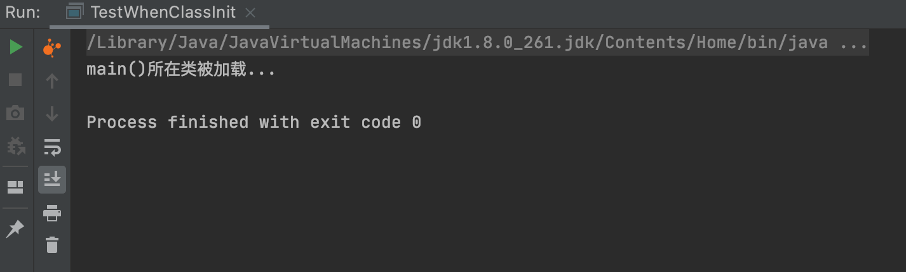

------


# 类加载器

- **类加载** ：将class文件字节码内容加载到内存中，并将这些静态数据转换成方法区的运行时数据结构，然后在堆中生成这个类的Class对象，作为方法区中类数据的访问入口

- **类缓存** ：标准的 JavaSE 类加载器可以按要求查找类，但一旦某个类被加载到类加载器中，它将维持加载（缓存）一段时间。不过 JVM 垃圾回收机制可以回收这些 Class 对象。

  

  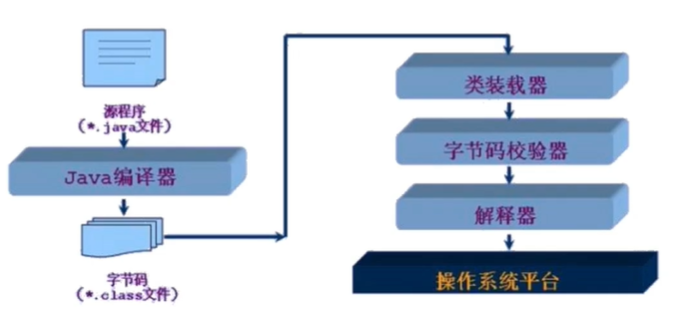

  

- **JVM 规范定义了如下类加载器** : 

  

  - **启动类加载器** **( Bootstrap Classloader )** ：是嵌在 JVM 内核中的加载器，该加载器是用C++语言写的，主要负责加载JAVA_HOME/lib下的类库，启动类加载器无法被应用程序直接使用。

    

  - **扩展类加载器 ( Extension ClassLoader )** : 它负责加载JRE的扩展目录，lib/ext或者由java.ext.dirs系统属性指定的目录中的Jar包的类。

    

  - **系统类加载器 ( System ClassLoader )** ，也称**应用程序加载器 ( Application ClassLoader )** : 它负责 java -classpath 或 -D java.class.path 所指的目录下的类与 jar 包装入工作，是最常用的类加载器。

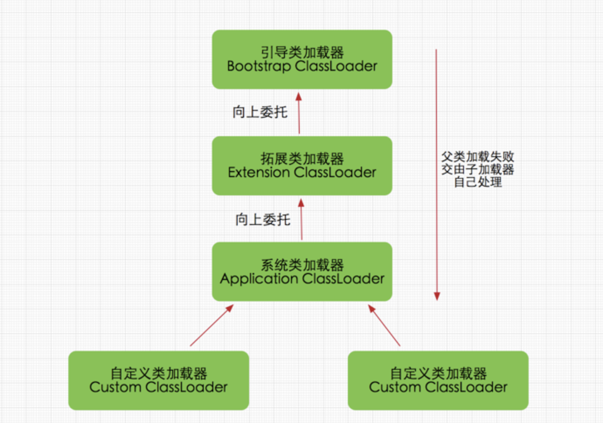

**<span style="color:red;">双亲委派机制</span>** ：如果一个类加载器收到了类加载请求，它并不会自己先去加载，而是把这个请求委托给父类的加载器去执行。如果父类加载器还存在其父类加载器，则进一步向上委托，依次递归，请求最终将到达顶层的启动类加载器。如果父类加载器可以完成类加载任务，就成功返回，倘若父类加载器无法完成此加载任务，子加载器才会尝试自己去加载。


​	获取几种类加载器参考代码：

```java
public class TestThreeClassLoaders {

    public static void main(String[] args) throws ClassNotFoundException {
        //  获取系统类加载器（应用程序加载器），输出AppClassLoader，说明系统类加载器就是应用程序类加载器
        ClassLoader systemClassLoader = ClassLoader.getSystemClassLoader();
        System.out.println(systemClassLoader);

        //  获取扩展类加载器 （系统类加载器的父类加载器），输出ExtClassLoader，说明系统类加载器的上层是扩展类加载器
        ClassLoader extensionClassLoader = systemClassLoader.getParent();
        System.out.println(extensionClassLoader);

        //  获取启动类加载器 （扩展类加载器的父类加载器），输出null，获取不到引导类加载器，说明扩展类加载器的上层是引导类加载器
        ClassLoader bootstrapClassLoader = extensionClassLoader.getParent();
        System.out.println(bootstrapClassLoader);

        //  测试当前类是由哪个加载器加载，输出AppClassLoader，说明对于用户自定义类来说，默认使用系统类加载器进行加载
        ClassLoader currentClassLoader = TestThreeClassLoaders.class.getClassLoader();
        System.out.println(currentClassLoader);

        //  测试JDK内置的类是由哪个加载器加载，输出null，Java的核心类库都是使用引导类加载器进行加载的
        ClassLoader jdkObjectClassLoader = Class.forName("java.lang.Object").getClassLoader();
        System.out.println(jdkObjectClassLoader);
    }

}
```


运行结果：

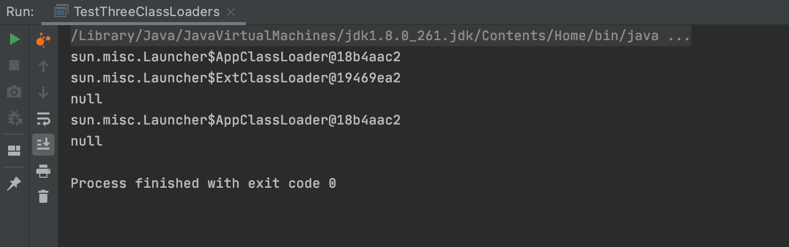

------


# 获取类的运行时结构

实体类 Person ：

```java
public class Person {

    public String id;

    public String name;

    private int age;

    public Person() {

    }

    private Person(int age) {
        this.age = age;
    }

    public Person(String id, String name, int age) {
        this.id = id;
        this.name = name;
        this.age = age;
    }

    public void setId(String id) {
        this.id = id;
    }

    public void setName(String name) {
        this.name = name;
    }

    private void setAge(int age) {
        this.age = age;
    }

    public String getId() {
        return id;
    }

    public String getName() {
        return name;
    }

    private int getAge() {
        return age;
    }

    @Override
    public String toString() {
        return "Person{" +
                "id='" + id + '\'' +
                ", name='" + name + '\'' +
                ", age=" + age +
                '}';
    }

}
```

获得运行时类的结构参考代码：

```java
public static void main(String[] args) throws ClassNotFoundException, NoSuchFieldException, NoSuchMethodException {

        Class personClass = Class.forName("com.tao.annotationandreflection.reflection.entity.Person");
        //  获得类的名字 (包名 + 类名)
        String packageName = personClass.getName();
        System.out.println("获得类的名字 (包名 + 类名)： " + packageName);

        //  获得类的名字 (类名)
        packageName = personClass.getSimpleName();
        System.out.println("获得类的名字 (类名)： " + packageName);

        //  获得类的public属性 (只可获取public属性)
        Field[] fields = personClass.getFields();
        for (Field field : fields) {
            System.out.println("获得类的public属性： " + field);
        }

        //  获得类的所有属性
        fields = personClass.getDeclaredFields();
        for (Field field : fields) {
            System.out.println("获得类的所有属性：" + field);
        }

        //  获得类的指定public属性 (只可获取public属性)
        Field nameField = personClass.getField("name");
        System.out.println("获得类的public属性：" + nameField);

        //  获得类的指定属性
        nameField = personClass.getDeclaredField("age");
        System.out.println("获得类的指定属性：" + nameField);

        //  获得类的public方法及其父类的方法 (只可获取public方法)
        Method[] method = personClass.getMethods();
        for (Method method1 : method) {
            System.out.println("获得类的public方法及其父类的方法：" + method1);
        }

        //  获得类的所有方法
        method = personClass.getDeclaredMethods();
        for (Method method1 : method) {
            System.out.println("获得类的所有方法：" + method1);
        }

        //  获得类的指定public方法 (只可获取public方法)
        Method getNameMethod = personClass.getMethod("getName", null);
        System.out.println("获得类的指定public方法：" + getNameMethod);
        Method setNameMethod = personClass.getMethod("setName", String.class);
        System.out.println("获得类的指定public方法：" + setNameMethod);

        //  获得类的指定方法
        Method getAgeMethod = personClass.getDeclaredMethod("getAge", null);
        System.out.println("获得类的指定方法：" + getAgeMethod);

        //  获得类的public构造器 （只可获取public构造器）
        Constructor[] constructors = personClass.getConstructors();
        for (Constructor constructor : constructors) {
            System.out.println("获得类的public构造器：" + constructor);
        }

        //  获得类的所有构造器
        constructors = personClass.getDeclaredConstructors();
        for (Constructor constructor : constructors) {
            System.out.println("获得类的所有构造器：" + constructor);
        }

        //  获得指定的public构造器 (只可获取public构造器)
        Constructor constructor = personClass.getConstructor(String.class, String.class, int.class);
        System.out.println("获得指定的public构造器：" + constructor);

        //  获得指定的构造器
        constructor = personClass.getDeclaredConstructor(int.class);
        System.out.println("获得指定的构造器：" + constructor);

    }
```

------


# 动态创建对象并执行方法

有了 **Class** 对象后，我们能做什么？

- **创建类的对象** ：1. new Instance( ) 方法（依赖于有无参构造方法，且构造器的访问权限足够）     2. getConstructor( ) / getDeclaredConstructor( ) 方法

  

- **调用指定方法** ：1. getMethod( ) / getDeclaredMethod( ) 方法     2.使用 Object 的 invoke( )方法进行传参调用

创建类的对象参考代码：

```java
public static void testGetObjectInstance() throws ClassNotFoundException, IllegalAccessException, InstantiationException, NoSuchMethodException, InvocationTargetException {
        Class personClass = Class.forName("com.tao.annotationandreflection.reflection.entity.Person");
        //  方式1：new Instance()，必须要有无参构造函数且构造器的访问权限需要足够
        Person person = (Person) personClass.newInstance();
        System.out.println(person);

        //  方式2：构造器
        Constructor constructor = personClass.getDeclaredConstructor(String.class, String.class, int.class);
        Person person1 = (Person) constructor.newInstance("0001", "Tao", 18);
        System.out.println(person1);
}
```

调用类的方法参考代码：

```java
public static void testInvokeObjectMethid() throws ClassNotFoundException, IllegalAccessException, InstantiationException, NoSuchMethodException, InvocationTargetException, NoSuchFieldException {
        Class personClass = Class.forName("com.tao.annotationandreflection.reflection.entity.Person");
        Person person = (Person) personClass.newInstance();
        //  反射获得一个方法
        Method setNameMethod = personClass.getDeclaredMethod("setName", String.class);
        //  invoke调用一个方法，invoke(对象,方法的值)
        setNameMethod.invoke(person, "Tao");
        System.out.println(person);

        Field age = personClass.getDeclaredField("age");
  			//	不能直接操作私有属性及方法...,需关闭程序的安全检查，设置可访问为true，否则报错
        age.setAccessible(true);
        age.set(person, 18);
        System.out.println(person);
        
}
```

**Object invoke(Object object ,Object... args)** : 

- Object 对应原方法的返回值，若原方法无返回值，此时返回null
  
-  若原方法为静态方法，此时形参Object object可为null

- 若原方法形参列表为空，则Object[]  args为null

- 若原方法声明为private，则需在调用此 invoke( ) 方法前，显式调用此方法的 setAccessible(true) 方法，即可访问 private 的方法

**setAccessible( )** :

- Method、Field、Constructor对象都有 setAccessible( ) 方法

- setAccessible( ) 的作用是启动和禁用访问安全检查的开关

- 数值为true，则指示反射的对象在使用时取消Java语言访问检查，提高了反射的效率，使得原本无法访问的私有成员也可以访问

------


# 性能对比分析

三种方式性能对比（普通方式、反射开启检查]、反射关闭检查）

```java
public class TestPerformance {

    /**
     * 普通方式
     */
    public static void normal() {
        Person person = new Person("0001", "Tao", 10);
        long startTime = System.currentTimeMillis();
        for (int i = 0; i < 100000000; i++) {
            person.getName();
        }
        long endTime = System.currentTimeMillis();
        System.out.println("普通方式执行一亿次需要：" + (endTime - startTime) + " ms");
    }

    /**
     * 反射方式，检查开启
     *
     * @throws InvocationTargetException
     * @throws IllegalAccessException
     * @throws NoSuchMethodException
     */
    public static void reflectionWithCheck() throws InvocationTargetException, IllegalAccessException, NoSuchMethodException {
        Person person = new Person("0001", "Tao", 10);
        Class personClass = person.getClass();
        Method getNameMethod = personClass.getDeclaredMethod("getName", null);
        long startTime = System.currentTimeMillis();
        for (int i = 0; i < 100000000; i++) {
            getNameMethod.invoke(person, null);
        }
        long endTime = System.currentTimeMillis();
        System.out.println("反射方式检查开启执行一亿次需要：" + (endTime - startTime) + " ms");
    }

    /**
     * 反射方式，检查关闭
     *
     * @throws InvocationTargetException
     * @throws IllegalAccessException
     * @throws NoSuchMethodException
     */
    public static void reflectionWithoutCheck() throws InvocationTargetException, IllegalAccessException, NoSuchMethodException {
        Person person = new Person("0001", "Tao", 10);
        Class personClass = person.getClass();
        Method getNameMethod = personClass.getDeclaredMethod("getName", null);
        getNameMethod.setAccessible(true);
        long startTime = System.currentTimeMillis();
        for (int i = 0; i < 100000000; i++) {
            getNameMethod.invoke(person, null);
        }
        long endTime = System.currentTimeMillis();
        System.out.println("反射方式检查开启执行一亿次需要：" + (endTime - startTime) + " ms");
    }

    public static void main(String[] args) throws IllegalAccessException, NoSuchMethodException, InvocationTargetException {
        normal();
        reflectionWithCheck();
        reflectionWithoutCheck();
    }

}
```

运行结果：

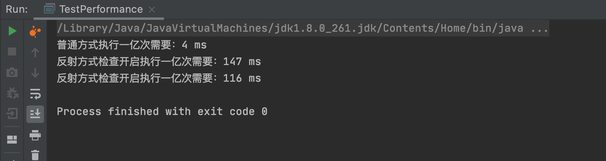

**<span style="color:red;">说明：setAccessible( ) 数值为true，则指示反射的对象在使用时取消Java语言访问检查，提高了反射的效率。</span>**

------


# 获取泛型信息

- Java 采用泛型擦除机制来引入泛型，Java 中的泛型仅仅是给编译器 javac 使用的，一旦编译完成，所有和泛型有关的类型全部擦除

- 为了通过反射操作这些类型，Java 新增了 Parameterized、GenericArrayType、TypeVariable 和 WildcardType 几种类型来表示不能被归纳到 Class 类中的类型但是又和原始类型齐名的类型

- Parameterized：表示一种参数化类型，比如 Collection<String>

- GenericArrayType：表示一种元素类型是参数化类型或者类型变量的数组类型

- TypeVariable：是各种类型变量的公共父接口

- WildCardType：代表一种通配符类型表达式

参考代码：

```java
public class TestGetGenericType {

    public void test1(Map<String, Person> map, List<Person> list) {
        System.out.println("test1...");
    }

    public Map<String, Person> test2() {
        System.out.println("test2...");
        return null;
    }

    public static void main(String[] args) throws NoSuchMethodException, SecurityException {
        Method method = TestGetGenericType.class.getMethod("test1", Map.class, List.class);
        Type[] genericParameterTypes = method.getGenericParameterTypes();
        for (Type genericParameterType : genericParameterTypes) {
            System.out.println("#" + genericParameterType);
            if (genericParameterType instanceof ParameterizedType) {
                Type[] actualTypeArguments = ((ParameterizedType) genericParameterType).getActualTypeArguments();
                for (Type actualTypeArgument : actualTypeArguments) {
                    System.out.println(actualTypeArgument);
                }
            }
        }

        method = TestGetGenericType.class.getMethod("test2", null);
        Type genericReturnType = method.getGenericReturnType();
        if (genericReturnType instanceof ParameterizedType) {
            Type[] actualTypeArguments = ((ParameterizedType) genericReturnType).getActualTypeArguments();
            for (Type actualTypeArgument : actualTypeArguments) {
                System.out.println(actualTypeArgument);
            }
        }
    }

}
```

运行结果：

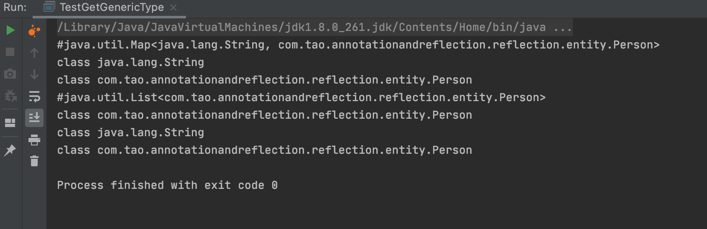

------


# 获取注解信息

这里以 ORM ( Object Relationship Mapping )  为例：对象关系映射

- 类和表结构对应
  
- 属性和字段对应
  
- 对象和记录对应

参考代码：

```java
public class TestGetAnnotation {

    public static void main(String[] args) throws ClassNotFoundException, NoSuchFieldException, SecurityException {
        Class studentClass = Class.forName("com.tao.annotationandreflection.reflection.Student");

        //  通过反射获得注解
        Annotation[] annotations = studentClass.getAnnotations();
        for (Annotation annotation : annotations) {
            System.out.println("获取到的Student类上的注解：" + annotation);
        }

        //  获取注解的value值
        TableName table = (TableName) studentClass.getAnnotation(TableName.class);
        String tableName = table.value();
        System.out.println("获取到的Student类上的注解TableName的值为：" + tableName);

        //  获取Student类指定属性上的注解
        Field fidld = studentClass.getDeclaredField("name");
        FieldName annotation = fidld.getAnnotation(FieldName.class);
        System.out.println(annotation.columnName());
        System.out.println(annotation.type());
        System.out.println(annotation.length());
    }

}

@TableName("db_student")
class Student {

    @FieldName(columnName = "db_id", type = "int", length = 10)
    private int id;

    @FieldName(columnName = "db_age", type = "int", length = 3)
    private int age;

    @FieldName(columnName = "db_name", type = "varchar", length = 10)
    private String name;

    public Student() {
        super();
    }

    public Student(int id, int age, String name) {
        super();
        this.id = id;
        this.age = age;
        this.name = name;
    }

    @Override
    public String toString() {
        return "Student [id=" + id + ", age=" + age + ", name=" + name + "]";
    }

}

/**
 * 类注解：表名
 */
@Target(ElementType.TYPE)
@Retention(RetentionPolicy.RUNTIME)
@interface TableName {
    String value();
}

/**
 * 属性注解：字段映射
 */
@Target(ElementType.FIELD)
@Retention(RetentionPolicy.RUNTIME)
@interface FieldName {
    String columnName();

    String type();

    int length();
}
```

运行结果：

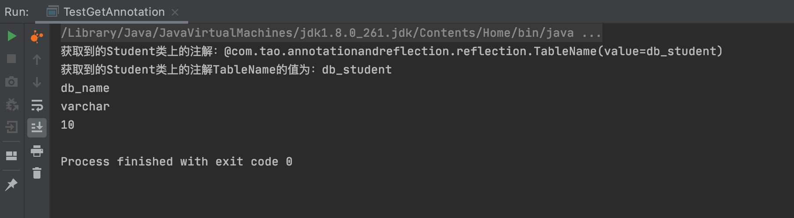