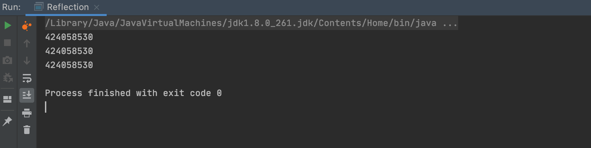

#

# 注解概述

> 注解（Annotation）: 放在Java源码的类、方法、字段、参数前的一种特殊“注释”

### 一、注解简介（Java.Annotation）

- Annotation 是从JDK5.0以后引入的新技术

- Annotation 的作用

  - 不是程序本身，可以对程序作出解释（这一点和注解（comment）没什么区别）
  - <span style="color:red;">可以被其他程序（比如：编译器）读取</span>
- Annotation 的格式：
  - 注解是以“@注释名”在代码中存在的，还可以添加一些参数值，例如：@SuppressWarnings(value="unchecked")
- Annotation 在哪里使用？
  - 可以附加在 package、class、method、field 等上面，相当于给他们添加了额外的辅助信息，我们可以通过反射机制编程实现对这些元数据的访问 

### 二、注解分类

**1.按来源分**

- 内置注解（JDK自带）
- 元注解
- 自定义注解

**2.按生命周期分**

- SOURCE：只存在于源代码中，编译成 class 文件不复存在
- Class：存在于源代码中和 class 文件中
- RUNTIME：注解保留到运行时

------

# 内置注解

JavaSE中内置三个标准注解，定义在 java.lang 中，它们分别是：

- **@Override**：定义在 java.lang.Override 中，此注释只适用于修辞方法，表示一个方法声明打算重写超类中的另一个方法声明
- **@Deprecated**：定义在 java.lang.Deprecated 中，此注释可以用于修饰方法、属性、类，表示不鼓励程序员使用这样的元素，通常是因为它很危险或者存在更好的选择
- **@SuppressWarnings**：定义在 java.lang.SuppressWarnings 中，用来抑制编译时的警告信息
  - 与前两个注释有所不同，你需要添加一个参数才嗯那个正确使用，这些参数都是已经定义好了的，我们选择性的使用就好了。
    1. @SuppressWarnings("all")
    2. @SuppressWarnings("unchecked")
    3. @SuppressWarnings(value = {"unchecked","deprecation"})
    4. ......

参考代码：

```java
public class BuiltInAnnotation {

    /**
     * Override：此注解只适用于修辞方法，重写超类中某方法
     * @return
     */
    @Override
    public String toString() {
        return super.toString();
    }

    /**
     * Deprecated：过时的、危险的、不推荐使用的，但仍可使用
     */
    @Deprecated
    public static void testDeprecated(){
        System.out.println("Hello Deprecated!");
    }

    /**
     * SuppressWarnings：抑制程序编译时的警告信息
     */
    @SuppressWarnings("all")
    public static void testSuppressWarnings(){
        int flag = 0;
    }

    public static void main(String[] args) {
        testDeprecated();
    }

}
```

------

# 元注解

- 元注解的作用就是负责注解其它注解，Java 定义了 4 个标准的 meta-annotation 类型，它们被用来提供对其它注解类型做说明
- 这些类型和它们所支持的类在 java.lang.annotation 包中可以找到（@Target，@Retention，@Documented，@Inherited）
  - **@Target**：用于描述注解的使用范围（即：被描述的注解可以用在什么地方）
  - **@Retention**：表示需要在什么级别保存该注释信息，用于描述注解的生命周期（SOURCE < CLASS < RUNTIME）
  - **@Document**：说明该注解将被包含在 JavaDoc 中
  - **@Inherited**：说明子类可以继承父类中的该注解

参考代码：

```java
@MyAnnotation
public class MetaAnnotation {

    /**
     * Java中定义了四个标注的元注解类型来对其他注解类型进行修饰
     * 1.@Target : 用于描述注解的使用范围,即被描述的注解可以用在什么地方
     * 2.@Retention : 用于描述注解的生命周期，即用在什么级别保存该注释信息（SOURCE < CLASS < RUNTIME）
     * 3.@Documented ：用于描述该注解将生成于 javadoc 中
     * 4.@Inherited ：用于描述子类可以继承父类中的注解
     */

    @MyAnnotation
    public void test(){

    }

}


@Target(value = {ElementType.TYPE, ElementType.FIELD,ElementType.METHOD})
@Retention(value = RetentionPolicy.RUNTIME)
@Documented
@Inherited
@interface MyAnnotation{

}
```

------

# 自定义注解

- 使用 @interface 自定义注解时，自动继承了 java.lang.annotation.Annotation 接口
- 分析：
  - @interface 用来声明一个注解，格式：public @interface 注解名 {定义内容}
  - 其中的每一个方法实际上是声明了一个配置参数
  - 方法的名称就是参数的名称
  - 返回值类型就是参数的类型（返回值只能是基本类型，Class，String，enum）
  - 可以通过 default 来声明参数的默认值
  - 如果只有一个参数成员，一般参数名为 value
  - 注解元素必须要有值，我们定义注解元素时，经常使用空字符串，0 作为默认值

参考代码：

```java
@MyCustomAnnotation(age = 0)
public class CustomAnnotation {

    /**
     * 1.使用@interface声明一个注解（ Public @interface xx{} ）
     * 2.其中每一个方法即为该注解的配置参数，方法名称就是参数名称，
     * 3.返回值类型可选：基本类型、Class、String、enum
     * 4.通过default声明参数的默认值，如果没有定义默认值，使用时必须对其参数进行赋值，如果只存在一个参数，一般命名为value
     * 5.注解元素必须要有值
     */

    @MyCustomAnnotation(age = 1, welcome = "Hello World!", personalAdvantages = {"玉树临风", "风流潇洒"})
    public void test() {

    }

}

/**
 * @author Tao
 */
@Target({ElementType.TYPE, ElementType.METHOD})
@interface MyCustomAnnotation {

    String welcome() default "Hello MyCustomAnnotation!";

    int age();

    String[] personalAdvantages() default {"阳光", "帅气"};

}
```

------

# 反射概述

> 反射是Java的高级特性，在框架中大量被使用！

### 一、静态语言和动态语言

- **静态语言**：与动态语言相对应，运行时结构不可变的语言就是静态语言，如 Java、C、C++

- **动态语言**：是一类在运行时可以改变其结构的语言：例如新的函数、对象、甚至代码可以被引进，已有的函数可以被删除或是其它结构上的变化（在运行时代码可以根据某些条件改变自身结构），如Object-C、C#、JavaScrip、PHP、Python

  以 JavaScript 为例：

  ```javascript
  var i = 100;
  function test() {
      var i = 'test';
      eval('i = "Hello World!"');
  }
  test();
  alert(i); 
  ```

<span style="color:red;">Java 不是静态语言，但是 Java 可以称之为 “准动态语言”。即 Java 有一定的动态性，我们可以利用反射机制获得类似动态语言的特性，让编程的时候更加灵活。</span>

### 二、反射机制

**反射（Reflection）**：是 Java 被视为动态语言的关键，反射机制允许程序在执行期借助于 Reflection API 取得任何类的内部信息，并能直接操作任意对象的内部属性以及方法。

```java
Class class = Class.forName("java.lang.String");
```

加载完类之后，在堆内存的方法区中就产生了一个 Class 类型的对象（一个类只有一个 Class 对象），这个对象就包含了完整类的类的结构信息。我们可以通过这个对象看到的类的结构。这个对象就像一面镜子，通过这个镜子看到类的结构，所以，我们形象地称之为：反射。

- 正常方式：1.引入需要的“包类”名称   ——>   2.通过 new 实例化   ——>   3.取得实例化对象
- 反射方式：1.实例化对象   ——>   2.getClass( ) 方法   ——>   3.得到完整的“包类”名称

### 三、反射机制提供的功能

- 在运行时判断任意一个对象所属的类
- 在运行时构造任意一个类的对象
- 在运行时判断任意一个类所具有的成员变量和方法
- 在运行时获取泛型信息
- 在运行时调用任意一个对象的成员变量和方法
- 在运行时处理注解
- 生成动态代理

### 四、反射的优缺点

- **优点：** 可以实现动态创建对象和编译，体现出很大的灵活性
- **缺点：** 对性能有影响。使用反射基本上是一种解释操作，我们可以告诉 JVM，我们希望做什么并且它满足我们什么要求，这类操作总是慢于直接执行相同的操作

### 五、反射相关的主要API

- java.lang.Class 代表一个类
- java.lang.reflect.Method 代表类的方法
- java.lang.reflect.Field 代表类的成员变量
- java.lang.reflect.Constructor 代表类的构造器

------

# 获得反射对象

定义一个实体类 Person

```java
public class Person {

    public String id;

    public String name;

    public int age;

    public Person() {

    }

    public Person(String id, String name, int age) {
        this.id = id;
        this.name = name;
        this.age = age;
    }

    public String getId() {
        return id;
    }

    public void setId(String id) {
        this.id = id;
    }

    public String getName() {
        return name;
    }

    public void setName(String name) {
        this.name = name;
    }

    public int getAge() {
        return age;
    }

    public void setAge(int age) {
        this.age = age;
    }

    @Override
    public String toString() {
        return "Person{" +
                "id='" + id + '\'' +
                ", name='" + name + '\'' +
                ", age=" + age +
                '}';
    }

}
```

获得其反射对象

```java
public static void testHashCode() throws ClassNotFoundException {
    Class c1 = Class.forName("com.tao.annotationandreflection.reflection.entity.Person");
    Class c2 = Class.forName("com.tao.annotationandreflection.reflection.entity.Person");
    Class c3 = Class.forName("com.tao.annotationandreflection.reflection.entity.Person");
    System.out.println(c1.hashCode());
    System.out.println(c2.hashCode());
    System.out.println(c3.hashCode());
}
```

输出


<span style="color:red;">哈希值一致说明一个类在JVM中只存在一个Class对象</span>

------

# Class类

### 一、认识 Class 类

在 Java 中 Object 类是所有类的父类。 该类中定义了以下方法，此方法将被所有子类继承。


即：

```java
public final native Class<?> getClass();
```

上面的方法返回值的类型是一个 Class 类，此类是 Java 反射的源头，实际上所谓反射从程序的运行结果来看也很好理解，即：可以通过对象反射求出类的名称。

对于每个类而言，JRE 都为其保留了一个不变的 Class 类型的对象。一个 Class 对象包含了特定某个结构（class、interface、enum、annotation、primitive type、void、[]）

- Class 本身也是一个类
- Class 对象只能由系统建立对象
- <span style="color:red;">一个加载的类在 JVM 中只会有一个 Class 实例</span>
- 一个 Class 对象对应的是一个加载到 JVM 中的一个 .class 文件
- 每个类的实例都会记得自己是由哪个 Class 实例所生成
- 通过 Class 可以完整地得到一个类中的所有被加载的结构
- Class 类是 Reflection 的根源，针对任何你想动态加载、运行的类、唯有先获得响应的 Class 对象

### 二、Class 类的常用方法

| 方法名                                  | 功能说明                                                     |
| :-------------------------------------- | :----------------------------------------------------------- |
| static Class forName(String name)       | 返回指定类名 name 的 Class 对象                              |
| Object newInstance()                    | 调用缺省构造函数，返回 Class 对象的一个实例                  |
| getName()                               | 返回此 Class 对象所表示的实体（类、接口、数组类、或 void）的名称 |
| Class getSuperClass()                   | 返回当前 Class 对象的父类的 Class 对象                       |
| Class[] getInterfaces()                 | 获取当前 Class 对象的接口                                    |
| ClassLoader getClassLoader()            | 返回该类的类加载器                                           |
| Constructor[] getConstructors()         | 返回一个包含某些 Constructor 对象的数组                      |
| Method getMethod(String name, Class… T) | 返回一个 Method 对象，此对象的形参类型为 paramType           |
| Field[] getDeclaredFields()             | 返回 Field 对象的一个数组                                    |

------

# 所有类型的Class对象

拥有Class对象的类型有：

- class：外部类、成员（成员内部类、静态内部类）、局部内部类、匿名内部类
- interface：接口
- []：数组
- enum：枚举
- annotation：注解 @interface
- primitive type：基本数据类型
- void

测试代码：

```java
public static void testClass() {
    Class c1 = Object.class;
    Class c2 = Comparable.class;
    Class c3 = int[].class;
    Class c4 = String[][].class;
    Class c5 = ElementType.class;
    Class c6 = Override.class;
    Class c7 = Integer.class;
    Class c8 = void.class;
    Class c9 = Class.class;

    System.out.println(c1);
    System.out.println(c2);
    System.out.println(c3);
    System.out.println(c4);
    System.out.println(c5);
    System.out.println(c6);
    System.out.println(c7);
    System.out.println(c8);
    System.out.println(c9);
}
```

运行结果：


------

# 获取Class类的几种方式

- 已知具体的类，可通过其类的class属性获取（最为安全可靠，性能最好）

  ```java
  Class class = Person.class;
  ```

- 已知某个类的实例，调用其getClass()方法获取Class对象

  ```java
  Class class = person.getClass();
  ```

- 已知一个类的全类名，且该类处于该路径下，可通过Class类的静态方法forName()获取（抛出异常ClassNotFoundException）

  ```java
  Class class = Class.forName("com.tao.annotationandreflection.reflection.entity.Person");
  ```

- 内置基本数据类型可通过.TYPE获取

  ```java
  Class c4 = 类名.TYPE;  
  ```

- 利用类加载器获取

  ```java
  ClassLoader classLoader = this.getClass().getClassLoader();
  Class class = classLoader.loadClass("com.tao.annotationandreflection.reflection.entity.Person");
  ```

参考代码：

```java
public void testWays() throws ClassNotFoundException {
    //  已知具体的类，可通过其类的class属性获取（最为安全可靠，性能最好）
    Class c1 = Person.class;

    //  已知某个类的实例，调用其getClass()方法获取Class对象
    Person person = new Person();
    Class c2 = person.getClass();

    //  已知一个类的全类名，且该类处于该路径下，可通过Class类的静态方法forName()获取（抛出异常ClassNotFoundException）
    Class c3 = Class.forName("com.tao.annotationandreflection.reflection.entity.Person");

    //  内置基本数据类型可通过.TYPE获取
    Class c4 = Integer.TYPE;    //  这里：(Class<Integer>) Class.getPrimitiveClass("int");

    //  利用类加载器获取
  	ClassLoader classLoader = this.getClass().getClassLoader();
    Class c5 = classLoader.loadClass("com.tao.annotationandreflection.reflection.entity.Person");
}
```

------

# 类加载内存分析

