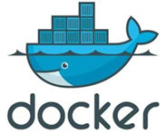

# Docker 概述

### 一、Docker的概念



- Docker 是一个开源的应用容器引擎

- 诞生于 2013 年初，基于 Go 语言实现， dotCloud 公司出品（后改名为Docker Inc）

-  Docker 可以让开发者打包他们的应用以及依赖包到一个轻量级、可移植的容器中，然后发布到任何流行的 Linux 机器上

- 容器是完全使用沙箱机制，相互隔离

- 容器性能开销极低

- Docker 从 17.03 版本之后分为 CE（Community Edition: 社区版） 和 EE（Enterprise Edition: 企业版）


### 二、为什么选择Docker

Docker 是为解决开发环境、测试环境以及生产环境中，可能出现的 “水土不服” 情况。


### 三、Docker的应用场景

- Web 应用的自动化打包和发布

- 自动化测试和持续集成、发布

- 在服务型环境中部署和调整数据库或其他的后台应用

- 从头编译或者扩展现有的 OpenShift 或 Cloud Foundry 平台来搭建自己的 PaaS 环境

  

------


# 安装 Docker

> Docker可以运行在MAC、Windows、CentOS、UBUNTU等操作系统上，这里将基于Windows 10 和 CentOS 7 安装Docker。

### 一、Windows下安装

1. ##### Win10 下需先开启 Hyper-V 功能 。

   

   

2. ##### 安装Toolbox ( https://hub.docker.com/editions/community/docker-ce-desktop-windows  ）。

   
   
   
   
   
   
3. ##### 安装完成后，可以在命令行执行 docker version 来查看版本号 。

   ```shell
   # 执行 docker version 来查看版本号
   docker version 
   ```

   

   

### 二、Linux下安装

1. ##### yum 包更新到最新版本 。

   ```shell
   # 升级所有包同时也升级软件和系统内核
   yum update
   ```

   

2. ##### 安装需要的软件包， yum-util 提供 yum-config-manager 功能，另外两个 device-mapper-persistent-data 和 lvm2 是 devicemapper 的驱动依赖 。 

   ```shell
   # 安装需要的软件包
   yum install -y yum-utils device-mapper-persistent-data lvm2
   ```


3. ##### 设置稳定的 yum 仓库 。																												

   ```shell
   # 设置yum源
   yum-config-manager --add-repo https://download.docker.com/linux/centos/docker-ce.repo
   ```

   

   

4. ##### 安装 Docker，出现输入的界面都按 y 。

   ```shell
   # 安装Docker，出现输入的界面都按 y 
   yum install -y docker-ce
   ```

   

   

5. ##### 查看 Docker 版本，验证是否验证成功 。

   ```shell
   # 查看Docker版本，验证是否验证成功
   docker -v
   ```

   


------


# Docker 架构

### 一、了解Docker三个重要概念


- **Image 镜像**： Docker 镜像（Image），就相当于是一个 root 文件系统。比如官方镜像 ubuntu:16.04 就包含了完整的一套 Ubuntu16.04 最小系统的 root 文件系统。 镜像可以用来创建docker容器。

  

- **Container 容器**： 镜像（Image）和容器（Container）的关系，就像是面向对象程序设计中的类和实例一样，镜像是静态的定义，容器是镜像运行时的实体。容器可以被创建、启动、停止、删除、暂停等。(<font color='red'>使用沙箱机制，每个容器相互隔离，保证平台的安全。</font>）

  

- **Repostory 仓库**： 仓库可看着一个代码控制中心，用来保存镜像。 (仓库分为两种：公有仓库和私有仓库。最大的公开仓库是Docker Hub，存放了数量庞大的镜像供用户下载。这里仓库的概念与Git类似，Registry 可以理解为 Github 这样的托管服务。)

  

------


# 配置 Docker 镜像加速器

> 默认情况下，将会从 DockerHub 拉取镜像。 国内从 DockerHub 拉取镜像有时会遇到困难 ，此时可以配置镜像加速器。（ 类似 Maven 的 Mirror ）

###  一、镜像加速器

Docker 官方和国内很多云服务商都提供了国内加速器服务，例如：

- USTC   ：中科大镜像加速器（ https://docker.mirrors.ustc.edu.cn ）

- 阿里云 ：( https://<你的ID>.mirror.aliyuncs.com )

- 网易云 ：( https://hub-mirror.c.163.com/ )

- 腾讯云 ：( https://mirror.ccs.tencentyun.com ) 

- 七牛云 ：( https://reg-mirror.qiniu.com )

  

### 二、配置镜像加速器

这里我们以配置阿里云镜像加速器为例：

1. ##### 获取阿里云镜像加速器地址 ：

每个阿里云账号的加速地址是唯一专属的（ https://<你的ID>.mirror.aliyuncs.com ）。登录网址 https://cr.console.aliyun.com/cn-hangzhou/instances/mirrors ，左侧菜单选中镜像加速器即可查看你的专属地址。


2. ##### 配置加速器地址：可根据自身的系统，依据上图中的操作文档，直接进行配置。

   ( 1 )  Linux  >>  Centos :  可以通过修改 daemon 配置文件 /etc/docker/daemon.json 来使用加速器。

   ```shell
   # 创建文件夹
   sudo mkdir -p /etc/docker
   
   # 用户输入的内容同时保存至文件daemon.json中
   sudo tee /etc/docker/daemon.json <<-'EOF'
   {
     "registry-mirrors": ["https://你的专属ID.mirror.aliyuncs.com"]
   }
   EOF
   
   # 重新加载Docker守护进程
   sudo systemctl daemon-reload
   
   # 重新启动Docker
   sudo systemctl restart docker
   ```

 		直接执行命令，并 cat 查看是否存在其内容：


   （ 2 ）Windows 10 ：Docker — Setting 下加入你的镜像加速地址 , 点击 Apply&Restart 保存后 Docker 就会重启并应用配置的镜像地址了。

   


### 三、检查镜像加速器是否生效

 执行 **docker info** 命令，如果从结果中看到了如下内容，说明配置成功。 

```shell
#显示Docker系统信息，包括镜像和容器数
docker info
```


-----


# Docker 相关命令

> 这部分包含主要三部分命令：服务相关命令、镜像相关命令、容器相关命令。对应图中的 daemon 、image 和 container 三部分。


### 一、 服务相关命令

服务相关命令，也成为后台守护进程相关命令，操作 Docker 整体。

- ##### 启动 Docker 服务

  ```shel
  systemctl start docker
  ```

- #####  停止 Docker 服务

  ```shell
  systemctl stop docker
  ```

- #####  重启 Docker 服务

  ```shell
  systemctl restart docker
  ```

- #####  查看 Docker 服务状态

  ```shell
  systemctl status docker
  ```

  开启时：active (running)

  

  关闭时：inactive (dead)

  

  

- #####  设置开机启动 Docker 服务

  ```shell
  systemctl enable docker
  ```

  

  

### 二、 镜像相关命令

- ##### 查看镜像：查看本地所有的镜像

  ```shell
  # 查看本地所有镜像
  docker images
  # 查看所有镜像的id
  docker images –q 
  ```

  默认为空：

  

  拉取后查看：

  

  其中字段TAG是该镜像的版本信息，IMAGE ID是镜像的唯一ID。

  <font color='red'>注意：我们观察这里的 Redis，存在两个，并且 IMAGE ID 相同，说明此时 Redis 最新版本就是6 。一个镜像可以打不同的版本名称，他们可能是同一个。</font>

  如下图：点开，其指向的都是6这个版本。

  

  

  

  

- ##### 搜索镜像：从网络中查找需要的镜像

  ```shell
  docker search 镜像名称
  ```

  

  其中字段 NAME 代表其镜像名称，DESCRIPTION 是该镜像的相关描述介绍，STARS 类似于Github 上的星数，<font color='red'>OFFICIAL 是否官方的（标示OK的为官方）</font>，AUTOMATED 是否自动流程构建的。

  

- #####  拉取镜像：从 Docker 仓库下载镜像到本地，镜像名称格式为 name:version 。

   <font color="red">如果版本号不指定则是最新的版本。如果不知道镜像版本，可以去 Docker Hub 搜索对应镜像查看。</font>

  ```shell
  docker pull 镜像名称
  ```

  


- #####  删除镜像：删除本地镜像

  ```shell
  # 通过镜像ID，删除指定本地镜像
  docker rmi 镜像id 
  # 通过进行名称和版本号，删除指定本地镜像
  docker rmi name:version
  #查看所有镜像id
  docker images -q
  # 删除所有本地镜像，``里面引用，相当于把``里面的执行的结果当做参数来执行
  docker rmi `docker images -q` 
  ```

  现有本地镜像：

  

  这里我们执行 docker rmi 96812ab2b931 （IMAGE ID 方式）来删除 Redis 镜像，发现该ID指向多个镜像仓库源，报错。

  

  此时我们可以通过 docker  REPOSITORY :TAG 方式来删除本地镜像，如下图所示。

  

  但此时，本地镜像并没有真正被删除，因为仍被 TAG 为 latest 的 redis 镜像所引用。不过，我们如果尝试去删除 IAMGE ID 在本地仅有一个引用的镜像时，如删除 TAG 为 8 的 mysql , 镜像将会被真正删除。

  


### 三、 容器相关命令

容器是由镜像和物理的文件运行出来的实例。容器相关命令主要是关于如何通过镜像创建出容器并且对齐进行相关操作。

- ##### 查看容器

  ```shell
  # 查看正在运行的容器
  docker ps
  # 查看所有容器
  docker ps –a 
  ```

  默认无：

  

  后续创建后查看：


- #####  创建并启动容器

  ```shell
  docker run  参数
  ```

  ```
  参数说明：
  • -i ：保持容器运行，通常与 -t 同时使用。加入 it 这两个参数后，容器创建后自动进入容器中。退出容器后，容器自动关闭 。
  • -t ：为容器重新分配一个伪输入终端，通常与 -i 同时使用 。
  • -d ：以守护（后台）模式运行容器。创建一个容器在后台运行，需要使用 docker exec 进入容器。退出后，容器不会关闭 。
  • -it ：创建的容器一般称为交互式容器，-id 创建的容器一般称为守护式容器 。
  • --name ：为创建的容器命名 。
  ```

  1. #####  以 -it 方式创建容器

     例：创建一个 Centos 容器：也可缩写成 docker run -it --name=c_centos centos:7 。


​					其中 centos:7 也可用 IMAGE ID 来替换 , 只要能保证可以指定唯一镜像，写成 docker run -it --					name=c_centos  5e35e350aded 。

​		<font color='red'>注意</font>：<font color='red'>①  -it 方式创建的容器，创建后将自动进入容器内部， [root@localhost ~ ] 也相应变成 							[root@c7a7562634f0 /] ,代表此时处于容器内部 。此时可执行该容器所包含的命令来进行相应操							作 。</font>

​					<font color='red'>② -it 方式创建的容器，执行 exit 退出容器后将回到宿主机，同时容器自动关闭 。</font>如下图所示：


2. ##### 以 -id 方式创建容器

   例：创建一个 Centos 容器：docker run -id --name=c_centos02  centos:7 。

   

   <font color='red'>*以 -id 方式创建的容器，将以守护（后台）模式运行。容器创建成功后不会自动进入容器内部 ，需要使用 docker exec 进入容器 ( “/bin/bash” 为进入容器的初始化指令，docker ps -a 后 COMMAND 字段可见 ) 。*</font>如下图：


<font color='red'>	*以 -id 方式创建的容器，exit 退出后，容器不会关闭。</font>


- ##### 进入容器

  ```shell
  # 退出容器，容器不会关闭
  docker exec 参数 
  ```

  

  

  

- #####  停止容器

  ```shell
  docker stop 容器名称/ID
  ```

  

  

- #####  启动容器

  ```shell
  docker start 容器名称/ID
  ```

  

  

- #####  删除容器

  ```shell
  # 删除容器
  docker rm 容器名称/ID
  # 查看所有容器ID
  docker ps -aq
  # 删除所有容器
  docker rm `docker ps -aq`
  ```

  

  <font color='red'>**如果容器是运行状态则删除失败，需要停止容器才能删除 。*</font>

- #####  查看容器信息

  ```shell
  docker inspect 容器名称/ID
  ```

  


------

# Docker 容器数据卷

> 问题：
>
> （1）Docker 容器删除后，在容器中产生的数据还在吗 ？
>
> （2）Docker 容器和外部机器可以直接交换文件吗 ？
>
> （3）容器之间如何进行数据交互 ？


### 一、数据卷概念及作用

Docker 的镜像是由一系列的只读层组合而来，当启动一个容器的时候，Docker 加载镜像的所有只读层，并在最上层加入一个读写层 。这个设计使得 Docker 可以提高镜像构建、存储和分发的效率，节省了时间和存储空间，然而也存在如下问题 。

- 容器中的文件在宿主机上存在形式复杂，不能在宿主机上很方便的对容器中的文件进行访问

- 多个容器之间的数据无法共享

- 当删除容器时，容器产生的数据将丢失

  

为了解决这些问题，Docker 引入了数据卷（volume）机制。volume 是存在一个或多个容器中的特定文件或文件夹，这个目录能够独立于联合文件系统的形式在宿主机中存在，并为数据的共享与持久提供一下便利 。

- volume 在容器创建时就初始化，在容器运行时就可以使用其中的文件
- volume 能在不同的容器之间共享和重用  ( <font color='red'>容器间的通信</font> )
- 对 volume 中的数据的操作会马上生效   （ <font color='red'>当容器目录和数据卷目录绑定后，对方的修改会立即同步 </font>）
- 对 volume 中数据操作不会影响到镜像本身
- volume 的生存周期独立于容器的生存周期 。（ <font color='red'>即使删除容器，volume 仍然会存在，没有任何容器使用的 volume 也不会被 Docker 删除</font> ）


**小结：**

1. 数据卷概念 ：宿主机的一个目录或文件
2. 数据卷作用：
   - 容器数据持久化
   - 客户端和容器数据交换
   - 容器间数据交换


### 二、配置数据卷

1. ##### **一个容器挂载一个数据卷**

   

   - 创建启动容器时，使用 –v 参数设置数据卷	

   ```shell
   # 设置数据卷
   docker run ... –v  宿主机目录(文件):容器内目录(文件) ...
   # 带权限的设置数据卷 (ro:read only,只读)
   docker run ... –v  宿主机目录(文件):容器内目录(文件):ro ...
   ```

    <font color='red'>注意事项：1. 目录必须是绝对路径      2. 如果目录不存在，会自动创建      3. 可以挂载多个数据卷</font>

   ​         这里我们创建一个名为 c_tomcat 的容器，挂载宿主机目录 /root/taoding 至 容器目录 /usr/local/tomcat/project_data 中（ 实际情况下，我们可以直接挂载至 c_tomcat 容器下 webapps 目录，方便以后部署系统 ），如下图所示：


​	  	   我们在宿主机挂载目录下或容器挂载目录下操作文件，对方会立即同步修改 。这里我们在容器内挂载			目录中创建一名为 test.txt 的文件，宿主机相应目录也相应生成改文件 。进一步在宿主机中修改 test.txt 文			件中内容，容器内相应文件也立即响应该修改 。


2.  **多个容器挂载同一数据卷，<font color='red'>实现容器间通讯</font>**

   

   


### 三、数据卷容器

> 问题：多容器进行数据交换：
>
> ​		1. 多个容器挂载同一个数据卷 （ 很多个，操作复杂，数据持久化、恢复等麻烦 ）


**数据卷容器**： 命名的容器挂载数据卷，其他的容器通过挂载这个父容器实现数据共享，挂载数据卷的容器，我们称为数据卷容器。 


1. 创建、启动数据卷容器，使用 –v 参数设置数据卷

  ```shell
  docker run –it --name ... –v 宿主机目录(文件):容器内目录(文件) ...
  ```


2. 创建启动容器，使用 –-volumes-from 参数设置数据卷

  ```shell
  docker run –it --name ... --volumes-from ...
  docker run –it --name ... --volumes-from ...
  ```

 


此时，我们在这些容器中操作数据或文件，其他容器或数据卷容器也将相应发生变化 。<font color='red'>即使容器所绑定的数据卷容器损坏或被删除，其下绑定的容器也可正常使用。</font>


-----

# Docker 下常用软件的部署应用

### 一、部署 MySQL

> 在 Docker 容器中部署 MySQL，并通过外部客户端操作 MySQL 。
>
> 实现步骤：① 搜索 MySQL 镜像    ② 拉取 MySQL 镜像    ③ 创建容器    ④ 操作容器中的 MySQL
>
> 可能遇见问题：容器内的网络服务和外部机器不能直接通信 。

针对可能遇见的问题：容器内的网络服务和外部机器不能直接通信，我们可以采取<font color='red'>**端口映射**</font>的方式解决。


解释：容器内的网络服务和外部机器不能直接通信，外部机器和宿主机可以直接通信，宿主机和容器可以直接通信 。当容器中的网络服务需要被外部机器访问时，可以将容器中提供服务的端口映射到宿主机的端口上 。外部机器访问宿主机的该端口，从而间接访问容器的服务 。

1. **搜索 MySQL 镜像**

   ```shell
   docker search mysql
   ```

   

   

2. **拉取 MySQL 镜像**

   ```shell
   docker pull mysql:5.6
   ```

   

   

3. **创建容器，设置端口映射、目录映射 ( 这里使用 3307 是宿主机3306 已经有一个 MySQL )**

   ```shell
   # 在/root目录下创建mysql目录用于存储mysql数据信息
    docker run -id  -p 3307:3306  --name=c_mysql \
    -v /root/taoding/mysql/conf:/etc/mysql/conf.d \
    -v /root/taoding/mysql/logs:/logs \
    -v /root/taoding/mysql/data:/var/lib/mysql \
    -e MYSQL_ROOT_PASSWORD=123456 \
    mysql:8
   ```

   

   参数说明：

   - **-p 3307:3306**：将容器的 3306 端口映射到宿主机的 3307 端口
   - **-v /root/taoding/mysql/conf:/etc/mysql/conf.d**：将主机当前目录下的 conf/my.cnf 挂载到容器的 /etc/mysql/my.cnf 配置目录
   - **-v /root/taoding/mysql/logs:/logs**：将主机当前目录下的 logs 目录挂载到容器的 /logs 日志目录
   - **-v /root/taoding/mysql/data:/var/lib/mysql** ：将主机当前目录下的data目录挂载到容器的 /var/lib/mysql 数据目录
   - **-e MYSQL_ROOT_PASSWORD=123456：**初始化 root 用户的密码。

   

4. **进入容器，操作 MySQL** 

   ```shell
   docker exec –it c_mysql /bin/bash
   ```

   

5. **使用外部机器连接容器中的 MySQL** 

   

   


### 二、部署 Tomcat

1. **搜索 Tomcat 镜像**

   ```shell
   docker search tomcat
   ```


2. **拉取 Tomcat 镜像**

   ```shell
   docker pull tomcat
   ```


3. **创建容器，设置端口映射、目录映射**

   ```shell
   docker run -id --name=c_tomcat \
   -p 8080:8080 \
   -v /root/taoding/tomcat:/usr/local/tomcat/webapps \
   tomcat:8
   ```


参数说明：

- **-p 8080:8080：**将容器的8080端口映射到主机的8080端口
- **-v /root/taoding/tomcat:/usr/local/tomcat/webapps：**将主机中当前目录挂载到容器的webapps

<font color='red'>注意：进入容器 c_tomcat 容器内部，不难发现原本 webapps 中文件都处于 webapps.dist 文件夹内，如需访问 Tomcat 自带的页面， 将 webapps.disp 下的文件全都移到 webapps 文件夹内即可 。</font>


4. **使用外部机器访问 Tomcat**

   


### 三、部署 Nginx

1. **搜索 Nginx 镜像**

   ```shell
   docker search nginx
   ```

   

   

2. **拉取 Nginx 镜像**

   ```shell
   docker pull nginx
   ```

   

   

3. **创建容器，设置端口映射、目录映射**

   ```shell
   # 在 /root/taoding 目录下创建 nginx 目录用于存储 nginx 数据信息
   mkdir ~/taoding/nginx
   cd ~/taoding/nginx
   mkdir conf
   cd conf
   # 在~/nginx/conf/下创建nginx.conf文件,粘贴下面内容
   vim nginx.conf
   ```

   ```shell
   user  nginx;
   worker_processes  1;
   
   error_log  /var/log/nginx/error.log warn;
   pid        /var/run/nginx.pid;
   
   
   events {
       worker_connections  1024;
   }
   
   
   http {
       include       /etc/nginx/mime.types;
       default_type  application/octet-stream;
   
       log_format  main  '$remote_addr - $remote_user [$time_local] "$request" '
                         '$status $body_bytes_sent "$http_referer" '
                         '"$http_user_agent" "$http_x_forwarded_for"';
   
       access_log  /var/log/nginx/access.log  main;
   
       sendfile        on;
       #tcp_nopush     on;
   
       keepalive_timeout  65;
   
       #gzip  on;
   
       include /etc/nginx/conf.d/*.conf;
   }
   
   ```

   ```shell
   docker run -id --name=c_nginx -p 80:80 \
   -v /root/taoding/nginx/conf/nginx.conf:/etc/nginx/nginx.conf \
   -v /root/taoding/nginx/logs:/var/log/nginx \
   -v /root/taoding/nginx/html:/usr/share/nginx/html \
   nginx
   ```

   

   

- 参数说明：

  - **-p 80:80**：将容器的 80端口映射到宿主机的 80 端口。
  - **-v /root/taoding/nginx/conf/nginx.conf:/etc/nginx/nginx.conf**：将主机当前目录下的 /conf/nginx.conf 文件挂载到容器的 :/etc/nginx/nginx.conf 配置文件 （<font color='red'>方便以后修改配置文件</font>）
  - **-v /root/taoding/nginx/logs:/var/log/nginx**：将主机当前目录下的 logs 目录挂载到容器的 /var/log/nginx 日志目录
  - **-v /root/taoding/nginx/html:/usr/share/nginx/html** ：将主机当前目录下的 html 目录挂载到容器 /usr/share/nginx/html 静态页面目录中，方便以后部署前端页面。

  

4. 在 /root/taoding/nginx/html 目录下创建测试页面，使用外部机器访问 Nginx

   

   

   

   


### 四、部署 Redis

1. **搜索 Redis 镜像**

   ```shell
   docker search redis
   ```

   

   

2. **拉取 Redis 镜像**

   ```shell
   docker pull redis
   ```

   


3. **创建容器，设置端口映射**

   ```shell
   docker run -id --name=c_redis -p 6379:6379 redis
   ```

   

   

4. **使用外部机器连接 Redis**

   

   

### 五、部署 Zookeeper

1. **搜索 Zookeeper 镜像**

   ```shell
   docker search zookeeper 
   ```

   

   

2. **拉取 Zookeeper镜像**

   ```shell
   docker pull zookeeper
   ```

   


3. **创建容器，设置端口映射**

   ```shell
   docker run -id --name=c_zookeeper -p 2182:2182 zookeeper
   ```

   

   

4. **使用命令查看 Zookeeper 运行状态**

   ```shell
   docker logs -f zk容器名称
   ```

   


-----

# Dockerfile

### 一、镜像原理

> 思考：
>
> - Docker 镜像本质是什么？
> - Docker 中一个 Centos 镜像为什么只有 200 MB，而一个 Centos 操作系统的 iso 文件要几个 G ？
> - Docker 中一个 Tomcat 镜像为什么有 500 MB，而一个 Tomcat 安装包只有 70 多 MB ？


操作系统组成部分：• 进程调度子系统    • 进程通信子系统    • 内存管理子系统    • 设备管理子系统  

​								   <font color='red'>• 文件管理子系统</font>    • 网络通信子系统    • 作业控制子系统


Linux文件系统由 bootfs 和 rootfs 两部分组成：

- bootfs：包含 bootloader（引导加载程序）和 kernel（内核）
- rootfs： root 文件系统，包含的就是典型 Linux 系统中的 /dev，/proc，/bin，/etc 等标准目录和文件
- <font color='red'>不同的 Linux 发行版，bootfs 基本一样，而 rootfs 不同，如 Ubuntu，Centos 等</font>

相似的，Docker 镜像原理：


- Docker 镜像是由特殊的文件系统叠加而成
- 最底端是 bootfs，并使用宿主机的 bootfs
- 第二层是 root 文件系统 rootfs ,称为 base imag
- 然后再往上可以叠加其他的镜像文件
- 统一文件系统（Union File System）技术能够将不同的层整合成一个文件系统，为这些层提供了一个统一的视角，这样就隐藏了多层的存在，在用户的角度看来，只存在一个文件系统 。
- 一个镜像可以放在另一个镜像的上面 。位于下面的镜像称为父镜像，最底部的镜像成为基础镜像 。
- 当从一个镜像启动容器时，Docker 会在最顶层加载一个读写文件系统作为容器


**总结：**

1. Docker 镜像本质是什么 ？
   - 一个分层文件系统 。

2. Docker 中一个 Centos 镜像为什么只有 200 MB，而一个 Centos 操作系统的 iso 文件要几个 G ？
   -  Centos 的 iso 镜像文件包含 bootfs 和 rootfs ，而 Docker 的 Centos 镜像复用操作系统的bootfs，只有 rootfs 和其他镜像层 。

3. Docker 中一个tomcat镜像为什么有500MB，而一个tomcat安装包只有70多MB？
   - 由于 Docker 中镜像是分层的，Tomcat 虽然只有 70 多MB，但他需要依赖于父镜像和基础镜像，所以整个对外暴露的 Tomcat 镜像为 500 多MB 。


### 二、容器转为镜像

```shell
docker commit  容器id  镜像名称: 版本号
```


<font color='red'>注意：在将容器转为镜像时，容器所通过目录挂载方式生成的文件夹及其文件将不被保留，其它挂载目录以外的文件，包含人为操作产生的数据及文件将被保留 。即目录挂载的都不生效 。</font>


### 三、镜像转为压缩文件

```shell
docker save -o  压缩文件名称  镜像名称:版本号
```


### 四、通过压缩文件还原镜像

```shell
docker load  –i  压缩文件名称
```


### 五、Dockerfile 概述及其关键字

> 因为通过容器转为镜像方式，目录挂载都不生效，所以这里引入 Dockerfile 实现应用的无缝移植。

**Dockerfile 概念：**

- Dockerfile 是一个文本文件
- 包含了一条条的指
- 每一条指令构建一层，基于基础镜像，最终构建出一个新的镜像
- 对于开发人员：可以为开发团队提供一个完全一致的开发环境
- 对于测试人员：可以直接拿开发时所构建的镜像或者通过 Dockerfile 文件构建一个新的镜像开始工作
- 对于运维人员：在部署时，可以实现应用的无缝移植


**Dockerfile 关键字：**

| 关键字      | 作用                     | 备注                                                         |
| ----------- | ------------------------ | ------------------------------------------------------------ |
| FROM        | 指定父镜像               | 指定 Dockerfile 基于哪个 image 构建                          |
| MAINTAINER  | 作者信息                 | 用来标明这个 Dockerfile 谁写的                               |
| LABEL       | 标签                     | 用来标明 Dockerfile 的标签，可以使用 Label 代替 Maintainer 最终都是在 docker images 基本信息中可以查看 。 |
| RUN         | 执行命令                 | 执行一段命令 默认是 /bin/sh 格式: RUN command 或者 RUN ["command" , "param1","param2"] |
| CMD         | 容器启动命令             | 提供启动容器时候的默认命令 和 ENTRYPOINT 配合使用.格式 CMD command param1 param2 或者 CMD ["command" , "param1","param2"] |
| ENTRYPOINT  | 入口                     | 一般在制作一些执行就关闭的容器中会使用                       |
| COPY        | 复制文件                 | build 的时候复制文件到 image 中（不会解压）                  |
| ADD         | 添加文件                 | build 的时候添加文件到 image 中，不仅仅局限于当前 build 上下文，可以来源于远程服务 。（<font color='red'>压缩文件会自动解压</font>） |
| ENV         | 环境变量                 | 指定 build 时候的环境变量 。可以在启动的容器的时候通过 -e 覆盖格式ENV name=value 。 |
| ARG         | 构建参数                 | 构建参数，只在构建的时候使用的参数 。如果有ENV，那么ENV的相同名字的值始终覆盖 arg 的参数 。 |
| VOLUME      | 定义外部可以挂载的数据卷 | 指定 build 的 image 那些目录可以启动的时候挂载到文件系统中 启动容器的时候使用 -v 绑定 格式 VOLUME ["目录"] |
| EXPOSE      | 暴露端口                 | 定义容器运行的时候监听的端口 启动容器的使用 -p 来绑定暴露端口 格式: EXPOSE 8080 或者 EXPOSE 8080/udp |
| WORKDIR     | 工作目录                 | 指定容器内部的工作目录 如果没有创建则自动创建 如果指定 / 使用的是绝对地址 如果不是/开头那么是在上一条 workdir 的路径的相对路径 |
| USER        | 指定执行用户             | 指定 build 或者启动的时候，用户在 RUN CMD ENTRYPONT 执行的时候的用户 。 |
| HEALTHCHECK | 健康检查                 | 指定监测当前容器的健康监测的命令，基本上没用。因为很多时候应用本身有健康监测机制 。 |
| ONBUILD     | 触发器                   | 当存在 ONBUILD 关键字的镜像作为基础镜像的时候，当执行 FROM 完成之后 会执行 ONBUILD 的命令，但是不影响当前镜像，用处也不怎么大。 |
| STOPSIGNAL  | 发送信号量到宿主机       | 该 STOPSIGNAL 指令设置将发送到容器的系统调用信号以退出 。    |
| SHELL       | 指定执行脚本的shell      | 指定 RUN CMD ENTRYPOINT 执行命令的时候使用的 shell           |

我们在编写 Dockerfile 时，可在 Docker Hub （ https://hub.docker.com/ ）上搜索镜像，模仿其写法进行编写。这里以 Tomcat 为例：


点击其中一个 Tags 


这边得到的就是其 Dockerfile 。


### 六、案例—部署SpringBoot项目

编写 Dockerfile 文件，内容如下：

```shell
FROM java:8
MAINTAINER taoding <991104402@qq.com>
ADD springboot-hello-0.0.1-SNAPSHOT.jar test.jar
CMD java -jar test.jar

```

 使用 Dockerfile 构建镜像 ,看见 Successfully ... 字样，构建成功 。

```shell
docker bulid –f dockerfile文件路径 –t 镜像名称:版本
```


检验是否成功：


-----

# Docker 服务编排

### 一、Docker Compose 概述

> 微服务架构的应用系统中一般包含若干个微服务，每个微服务一般都会部署多个实例，如果每个微服务都要手动启停，维护的工作量会很大 。
>
> - 要从 Dockerfile build image 或者去 Docker Hub 拉取 image
> -  要创建多个 Container
> -  要管理这些 Container（启动、停止、删除）


**服务编排**： 按照一定的业务规则批量管理容器

Docker Compose 是一个编排多容器分布式部署的工具，提供命令集管理容器化应用的完整开发周期，包括服务构建，启动和停止 。使用步骤：
1. 利用 Dockerfile 定义运行环境镜像
2. 使用 docker-compose.yml 定义组成应用的各服务
3. 运行 docker-compose up 启动应用


### 二、Docker Compose 安装使用

- **安装 Docker Compose**

  目前已经完全支持 Linux、Mac OS 和 Windows，在我们安装 Compose 之前，需要先安装 Docker 。

  ```shell
  # 安装 Dokcer Compose
  curl -L https://github.com/docker/compose/releases/download/1.22.0/docker-compose-`uname -s`-`uname -m` -o /usr/local/bin/docker-compose
  # 设置文件可执行权限 
  chmod +x /usr/local/bin/docker-compose
  # 查看版本信息 
  docker-compose -version
  ```


- **卸载 Docker Compose**

  ```shell
  # 删除其二进制文件
  rm /usr/local/bin/docker-compose
  ```


### 三、编排Nginx+SpringBoot项目

- **创建 docker-compose 目录**

  ```shell
  mkdir ~/taoding/docker_compose
  cd ~/taoding/docker_compose
  ```

  

- **编写 docker-compose.yml 文件**

  ```shell
  # 指定docker-compose版本
  version: '3'
  # 定义/启动哪些容器、服务 （nginx、test_app）
  services:
    nginx:
     image: nginx
     ports:
      - 80:80
     links:
      - test
     volumes:
      - ./nginx/conf.d:/etc/nginx/conf.d
    test:
      image: test
      expose:
        - "8080"
  ```

  

- **创建 ./nginx/conf.d 目录**

  ```shell
  mkdir -p ./nginx/conf.d
  ```

  

- **在 ./nginx/conf.d 目录下编写 nginx.conf 文件**

  ```shell
  server {
      listen 80;
      access_log off;
  
      location / {
          proxy_pass http://test:8080;
      }
     
  }
  ```

  

- **在~/docker-compose 目录下 使用docker-compose 启动容器**

  ```shell
  docker-compose up
  ```

  


- **测试访问**

  

  


-----

# Docker 私有仓库

### 一、搭建私有仓库

- **拉取私有仓库镜像** 

  ```shell
  docker pull registry
  ```

- **启动私有仓库容器** 

  ```shell
  docker run -id --name=registry -p 5000:5000 registry
  ```

  验证：浏览器输入地址http://你的IP:5000/v2/_catalog，如看到  {"repositories":[]}  表示私有仓库搭建成功。
  
  
  
  


- **修改 daemon.json ，在文件中添加一个key，保存退出。此步用于让 Docker 信任私有仓库地址。注意将私有仓库服务器 IP 修改为自己私有仓库服务器真实 IP 。{"insecure-registries":["私有仓库服务器ip:5000"]}** 

  ```shell
  vim /etc/docker/daemon.json  
  ```

- 重启 Docker 服务 

  ```shell
  # 重启Docker服务
  systemctl restart docker
  # 开启私有仓库
  docker start registry
  ```

  
  
  

### 二、上传镜像

- **标记镜像为私有仓库的镜像**   

  ```shell
  docker tag 镜像名称:版本 私有仓库服务器IP:5000/镜像名称:版本
  ```

- **上传标记的镜像** 

  ```shell
  docker push 私有仓库服务器IP:5000/镜像名称:版本
  ```

  
  
  
  
  
  
  <font color='red'>注意：这里为了测试，私有仓库用的同一台服务器 。</font>
  
  

### 三、拉取镜像

- **拉取镜像**

  ```shell
  docker pull 私有仓库服务器ip:5000/镜像名称:版本
  ```

  
  
  